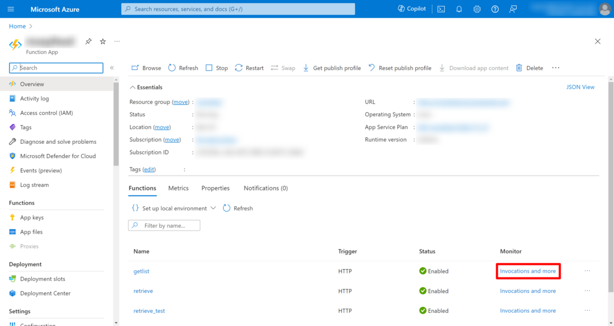
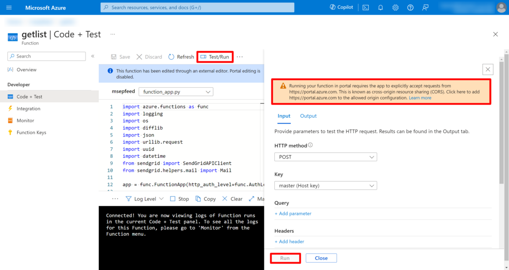
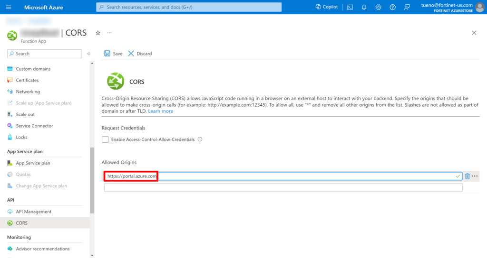
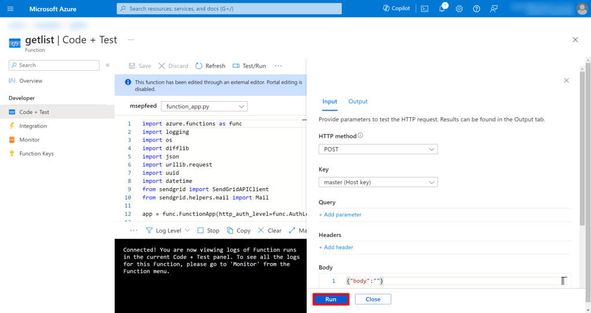
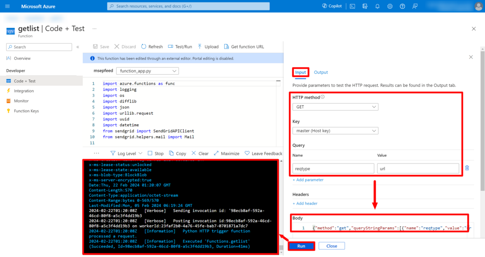
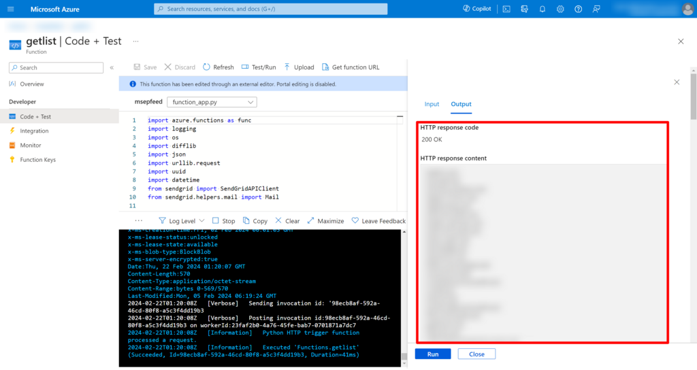

<!-- omit in toc -->
# Azure Function App でコードを動かす

Azure Function Appはサーバーレスでコードを動かすことができるサービスで、AWSでいうところのLambda。<br>
簡単なAPIとかシンプルなWebサービスを実装したりするのに使えそうな代物である。<br>
MSのサービスなので開発はVS Code前提となる。

ここではWindows10/11環境でAzure Function Appを開発する方法をまとめる。<br>
前提条件として [**Python開発環境の基本設定**](./python-devenv-windows) を先に済ませておく。<br>


- [1. 開発環境の概要](#1-開発環境の概要)
- [2. Azurite セットアップ](#2-azurite-セットアップ)
  - [2.1. \[WSL\] 必要なパッケージをインストール](#21-wsl-必要なパッケージをインストール)
  - [2.2. \[WSL\] Azuriteを動かす](#22-wsl-azuriteを動かす)
  - [2.3. 接続テスト](#23-接続テスト)
- [3. VS Codeセットアップ](#3-vs-codeセットアップ)
  - [3.1. Extensionをインストール](#31-extensionをインストール)
  - [3.2. Function Appのプロジェクトを作成](#32-function-appのプロジェクトを作成)
- [4. 開発プロジェクトの環境について](#4-開発プロジェクトの環境について)
  - [4.1. プロジェクトごとにフォルダ(環境)が作成される](#41-プロジェクトごとにフォルダ環境が作成される)
  - [4.2. .vscodeサブフォルダの主なファイル](#42-vscodeサブフォルダの主なファイル)
  - [4.3. Blobストレージの使い方（ローカル）](#43-blobストレージの使い方ローカル)
  - [4.4. Blobストレージの使い方（Azure）](#44-blobストレージの使い方azure)
  - [4.5. Debian 12でAzure Functions Core Toolsを使うための設定](#45-debian-12でazure-functions-core-toolsを使うための設定)
- [5. その他](#5-その他)
  - [5.1. プロジェクトを作り直したいとき](#51-プロジェクトを作り直したいとき)
  - [5.2. テストツール](#52-テストツール)
  - [5.3. セキュリティ](#53-セキュリティ)
  - [5.4. difflib](#54-difflib)
  - [5.5. Email](#55-email)
    - [5.5.1. SendGrid](#551-sendgrid)
      - [5.5.1.1. Azure Functions における SendGrid のバインディング](#5511-azure-functions-における-sendgrid-のバインディング)
      - [5.5.1.2. モジュールの読み込み](#5512-モジュールの読み込み)
    - [5.5.2. Azure Communcation Service](#552-azure-communcation-service)
  - [5.6. プロジェクト作成時に生成されるサンプルコード](#56-プロジェクト作成時に生成されるサンプルコード)
  - [5.7. トラブルシュート](#57-トラブルシュート)
    - [5.7.1. Azure PortalでFunctionを実行してログを確認する](#571-azure-portalでfunctionを実行してログを確認する)


# 1. 開発環境の概要
開発環境：<br>
- Windows10/11, WSL2
- VS Code (WSL Extension, Azure Functions Extension & Python Extension)
- [WSL] Azure Functions Core Tools
- [WSL] Python 3.11 (3.12はVS CodeのAzure Functions Extesionが対応していない)
- [WSL] Azurite (Azure Storage Emulator)

開発作業の流れ：<br>
- VS Codeでコードを書いてローカル環境でデバッグする
- Blobストレージを使う場合はクラウドに接続するかAzuriteでエミュレートする
- ローカル環境で正常に動作することが確認できたら、VS CodeからAzureアカウントにログインしてコードをデプロイする

参照：<br>
- [Visual Studio Code を使用して Azure Functions を開発する](https://learn.microsoft.com/ja-jp/azure/azure-functions/functions-develop-vs-code?tabs=node-v3%2Cpython-v2%2Cisolated-process&pivots=programming-language-python)
- [Pythonで記述するAzure FunctionsのV2 modelを試してみる](https://zenn.dev/choshicure/articles/364875750f8888)

# 2. Azurite セットアップ

<!--
## (いらないかも)Azure Functions Core Toolsをインストール
https://github.com/Azure/azure-functions-core-tools?tab=readme-ov-file#installing
-->

## 2.1. [WSL] 必要なパッケージをインストール
```
sudo apt-get install npm
sudo npm install -g azurite
sudo npm install -g azure-functions-core-tools@4
```

## 2.2. [WSL] Azuriteを動かす
```
mkdir azurite
azurite --silent --location /path/to/folder --debug /path/to/folder/debug.log
```

## 2.3. 接続テスト
https://azure.microsoft.com/en-us/products/storage/storage-explorer/


# 3. VS Codeセットアップ

## 3.1. Extensionをインストール
- `CTRL + SHIFT + P` でコマンドパレットを開いて `Connect to WSL` を実行<br>
- `CTRL + SHIFT + X` でExtensionを開いて `Azure Functions` をインストール<br>
(Azure ResourcesとAzure Accountも一緒にインストールされる)

## 3.2. Function Appのプロジェクトを作成
Terminal > New TerminalでWSL bashを開いてプロジェクトフォルダを作成
```
mkdir funcapp01
```

(1) `SHIFT + ALT + A` でAzure Functions Extensionを開く<br>
(2) `WORKSPACE(Local)` > `Create New Project`
Select folder: `funcapp01`<br>
Select language: `Python`<br>
Select Python programming model: `Model V2`<br>
Select Python interpreter: Skip virtual environment<br>
Select template: `HTTP Trigger`<br>
Name of function: `http_trigger` (default)<br>
Authorization level: `FUNCTION`<br>
(3) `Local Project(funcapp01)` > `Functions` > `Start debugging to update this list` でデバッグ実行<br>
(4) ストレージへの接続が要求されるので `Use Local Emulator` (Azurite)を選択する<br>
(5) Terminalに以下のようなログが出力される(Azure Functions Core ToolがWSLにインストールされ、python仮想環境も作成されている)
```
 *  Executing task: .venv/bin/python -m pip install -r requirements.txt 

Collecting azure-functions
  Downloading azure_functions-1.18.0-py3-none-any.whl (173 kB)
     ━━━━━━━━━━━━━━━━━━━━━━━━━━━━━━━━━━━━━━━━ 173.2/173.2 kB 2.0 MB/s eta 0:00:00
Installing collected packages: azure-functions
Successfully installed azure-functions-1.18.0
 *  Terminal will be reused by tasks, press any key to close it. 

 *  Executing task: . .venv/bin/activate && func host start 

Found Python version 3.11.2 (python3).

Azure Functions Core Tools
Core Tools Version:       4.0.5455 Commit hash: N/A  (64-bit)
Function Runtime Version: 4.27.5.21554

[2024-01-30T14:04:53.514Z] Customer packages not in sys path. This should never happen! 
[2024-01-30T14:04:54.449Z] 0.16s - Debugger warning: It seems that frozen modules are being used, which may
[2024-01-30T14:04:54.449Z] 0.00s - make the debugger miss breakpoints. Please pass -Xfrozen_modules=off
[2024-01-30T14:04:54.449Z] 0.00s - to python to disable frozen modules.
[2024-01-30T14:04:54.449Z] 0.00s - Note: Debugging will proceed. Set PYDEVD_DISABLE_FILE_VALIDATION=1 to disable this validation.
[2024-01-30T14:04:54.562Z] Worker process started and initialized.

Functions:

        http_trigger:  http://localhost:7071/api/http_trigger

For detailed output, run func with --verbose flag.
[2024-01-30T14:04:59.601Z] Host lock lease acquired by instance ID '000000000000000000000000BE651026'.
```
(6) Function Appの動作確認<br>
`http://localhost:7071/api/http_trigger?name=test` にアクセスして以下のように表示されたら正常に動いている。
```
Hello, test. This HTTP triggered function executed successfully.
```

(7) Python仮想環境を作成<br>
- `CTRL + SHIFT + P` でコマンドパレットを開いて `Select Python Interpreter` を実行<br>
  `Create Virtual Environment...` を選択<br>
  Select environment type: `Venv` を選択<br>
  Select Python installation to create venv: `/bin/python3` などを選択<br>
  Select dependecies: `requirements.txt`<br>
- 仮想環境(venv)が作成されて、これ以降このワークスペースでTerminalを開くと自動的にvenvが有効になる<br>

# 4. 開発プロジェクトの環境について
## 4.1. プロジェクトごとにフォルダ(環境)が作成される
Azure Functions Extensionでフォルダを指定してNew Projectを作成すると、<br>
- ウィザードでPython Interpreterを指定してPython仮想環境(.venvサブフォルダ)が作成される
- ウィザードで入力した情報でプロジェクト環境設定(.vscodeサブフォルダ)が作成される
- Function Appファイル (function_app.py, host.json, local.settings.json, requirements.txt) が作成される

## 4.2. .vscodeサブフォルダの主なファイル
- settings.json -> Languate, LanguageModel, venvフォルダなど
- tasks.json -> デバッグ実行時に自動的に実行されるタスク

.vscode/settings.json:<br>
```
{
  "azureFunctions.deploySubpath": ".",
  "azureFunctions.scmDoBuildDuringDeployment": true,
  "azureFunctions.pythonVenv": ".venv",
  "azureFunctions.projectLanguage": "Python",
  "azureFunctions.projectRuntime": "~4",
  "debug.internalConsoleOptions": "neverOpen",
  "azureFunctions.projectLanguageModel": 2
}
```

.vscode/tasks.json:<br>
```
{
  "version": "2.0.0",
  "tasks": [
    {
      "type": "func",
      "label": "func: host start",
      "command": "host start",
      "problemMatcher": "$func-python-watch",
      "isBackground": true,
      "dependsOn": "pip install (functions)"
    },
    {
      "label": "pip install (functions)",
      "type": "shell",
      "osx": {
        "command": "${config:azureFunctions.pythonVenv}/bin/python -m pip install -r requirements.txt"
      },
      "windows": {
        "command": "${config:azureFunctions.pythonVenv}/Scripts/python -m pip install -r requirements.txt"
      },
      "linux": {
        "command": "${config:azureFunctions.pythonVenv}/bin/python -m pip install -r requirements.txt"
      },
      "problemMatcher": []
    }
  ]
}
```

## 4.3. Blobストレージの使い方（ローカル）
ローカル(Azurite)でエミュレートする場合とAzureに接続する場合でStorage Connectionパラメータが異なるので、それを環境変数で吸収している。<br>
以下ローカル(Arurite)の場合の例。

`local.setting.json:`<br>
ローカル環境で環境変数を設定する為に使用すファイル。<br>
ここでは `StorageConnection` 変数に接続パラメータを設定している。
```
{
  "IsEncrypted": false,
  "Values": {
    "AzureWebJobsStorage": "UseDevelopmentStorage=true",
    "FUNCTIONS_WORKER_RUNTIME": "python",
    "AzureWebJobsFeatureFlags": "EnableWorkerIndexing",
    "StorageConnection": "AccountName=devstoreaccount1;AccountKey=Eby8vdM02xNOcqFlqUwJPLlmEtlCDXJ1OUzFT50uSRZ6IFsuFq2UVErCz4I6tq/K1SZFPTOtr/KBHBeksoGMGw==;DefaultEndpointsProtocol=http;BlobEndpoint=http://127.0.0.1:10000/devstoreaccount1;QueueEndpoint=http://127.0.0.1:10001/devstoreaccount1;TableEndpoint=http://127.0.0.1:10002/devstoreaccount1"
  }
}
```

`function_app.py:`<br>
Function App内で `Storage Connection` 変数を使ってストレージ接続を定義している。
```
....
app = func.FunctionApp(http_auth_level=func.AuthLevel.FUNCTION)

@app.route(route="http_trigger")
@app.blob_input(arg_name="inputblob",
                path="aaa/bbb.txt",
                connection="StorageConnection")
@app.blob_output(arg_name="outputblob",
                path="ccc/ddd.txt",
                connection="StorageConnection")
def http_trigger(req: func.HttpRequest, inputblob: str, outputblob: func.Out[str]) -> func.HttpResponse:
...
```

## 4.4. Blobストレージの使い方（Azure）
Function App内の `Configuration` > `Application Setting` で環境変数を設定する。

<https://learn.microsoft.com/ja-jp/azure/azure-functions/functions-bindings-storage-blob-output?tabs=python-v2%2Cisolated-process%2Cnodejs-v4&pivots=programming-language-python><br>
「_アプリ設定の名前が “AzureWebJobs” で始まる場合は、ここで名前の残りの部分のみを指定できます。 たとえば、connection を “MyStorage” に設定した場合、Functions ランタイムは “AzureWebJobsMyStorage” という名前のアプリ設定を探します。 connection を空のままにした場合、Functions ランタイムは、アプリ設定内の AzureWebJobsStorage という名前の既定のストレージ接続文字列を使用します。」<br>

と記載されているが、AzureWebJobsを頭につけなくても問題なかった。<br>
なので上記ローカル環境での環境変数名に合わせると、以下のどちらかを設定すればOK。<br>
`AzureWebJobsStorageConnection`<br>
`StorageConnection`

## 4.5. Debian 12でAzure Functions Core Toolsを使うための設定
azure-functions-core-tools のDebianパッケージがまだDebian11までしか対応していないので(as of Feb 2024)、apt lineを編集する必要がある。<br>
<https://github.com/Azure/azure-functions-core-tools/issues/3431>
```
as a workaround until the official Debian 12 package is released I was able to run the Debian 11 azure-functions-core-tools package on Debian 12.
to do so - manually replace:
https://packages.microsoft.com/debian/12/prod bookworm main
with:
https://packages.microsoft.com/debian/11/prod bullseye main
in:
/etc/apt/sources.list.d/dotnetdev.list
```

# 5. その他
## 5.1. プロジェクトを作り直したいとき
VS Codeを終了＞フォルダを削除＞VS Codeを起動

## 5.2. テストツール
APIDOG<br>
<https://apidog.com/jp/blog/http-request-body/>

## 5.3. セキュリティ
Azure App Service のアクセス制限を設定する<br>
<https://learn.microsoft.com/ja-jp/azure/app-service/app-service-ip-restrictions?tabs=azurecli>

## 5.4. difflib
difflibで文字列の差分比較をする【Python】<br>
<https://hmjp.net/archive2019/blog/basic-python-difflib/>

## 5.5. Email
Function Appからメールを送信したい場合。<br>
SendGridという外部サービスがよく使われているようだが、Azure Communication Serviceというのも使えるらしい。<br>
SendGridの無償利用枠は1日あたり100通に制限されている。

### 5.5.1. SendGrid
<https://sendgrid.com/>

#### 5.5.1.1. Azure Functions における SendGrid のバインディング<br>
<https://learn.microsoft.com/ja-jp/azure/azure-functions/functions-bindings-sendgrid?tabs=isolated-process%2Cfunctionsv2&pivots=programming-language-python>

#### 5.5.1.2. モジュールの読み込み
実行するときにsendgridモジュールを読み込むようにする。<br>

requirements.txt:
```
# DO NOT include azure-functions-worker in this file
# The Python Worker is managed by Azure Functions platform
# Manually managing azure-functions-worker may cause unexpected issues

azure-functions
azure-storage-blob
sendgrid
```

### 5.5.2. Azure Communcation Service
Quickstart: How to send an email using Azure Communication Service<br>
<https://learn.microsoft.com/en-us/azure/communication-services/quickstarts/email/send-email?tabs=windows%2Cconnection-string&pivots=platform-azportal><br>
Python 用 Azure Communication Email クライアント ライブラリ - バージョン 1.0.0<br>
<https://learn.microsoft.com/ja-jp/python/api/overview/azure/communication-email-readme?view=azure-python>

## 5.6. プロジェクト作成時に生成されるサンプルコード
まずはここから。
```
import azure.functions as func
import logging

app = func.FunctionApp(http_auth_level=func.AuthLevel.FUNCTION)

@app.function_name(name=“http_trigger")
@app.route(route="http_trigger")
def http_trigger(req: func.HttpRequest) -> func.HttpResponse:
    logging.info('Python HTTP trigger function processed a request.’)

    name = req.params.get('name')
    if not name:
        try:
            req_body = req.get_json()
        except ValueError:
            pass
        else:
            name = req_body.get('name')

    if name:
        return func.HttpResponse(f"Hello, {name}. This HTTP triggered function executed successfully.")
    else:
        return func.HttpResponse(
             "This HTTP triggered function executed successfully. Pass a name in the query string or in the request body for a personalized response.",
             status_code=200
        )
```

## 5.7. トラブルシュート
ローカルで動いているものをAzureにデプロイしてうまく動かない場合のトラブルシュート方法。<br>

### 5.7.1. Azure PortalでFunctionを実行してログを確認する
Function AppのOverviewから、対象のFunctionのMonitorリンクをクリックする。(下図の赤枠部分)


Code＋TestからTest/Runを選択してFunctionを実行して動作を確認したいが、CORSのエラーが出て実行できない。


なのでCORSでportal.azure.comを設定する。


そうするとAzure PortalからHTTPトリガーでコードを実行できるようになる。


HTTPメソッド、パラメータなど設定してリクエスト実行。<br>
左下のウィンドウにログが表示される。


実行時の出力は右下に表示される。


